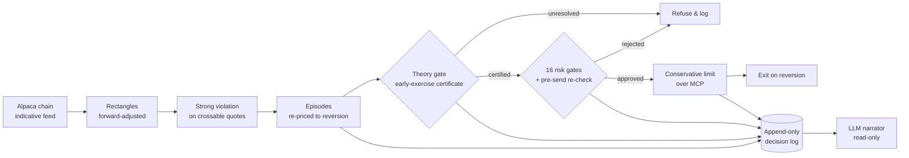

# ◢ MarginCalled

**A theorem-gated options arbitrage agent for SPY, SPX and XSP.**
It hunts for four-contract price rectangles that break a no-arbitrage rule, trades only the ones it can *prove* are real, and waits for the mispricing to correct.

[](https://margincalled.streamlit.app/)
[](LICENSE)


Built for the **Alpaca AI Trading Agents Hackathon** (28 Aug – 4 Sep 2026).

> **🔗 [Live dashboard](https://margincalled.streamlit.app/) · [Full project report](PROJECT_REPORT.md) · [One-page write-up](WRITEUP.md) · [How it works](PIPELINE.md)**

---

## The result, honestly

| | |
|---|---|
| Rectangles scanned | **192,008,262** |
| Violations detected | **17,097** |
| Episodes tracked → **reverted** | 43,566 → **98%**, median **~11 min** |
| **Backtest** (T1, same live filters, both sides cross the spread) | **+$9,829** over 672 trades, **67% win** |
| Live paper trading (1½ sessions) | 21 round-trips, **every one closed on reversion**, **−$45** |
| Broker commissions | **$0** |

**The signal is real and it reverts on schedule. The catch is execution:** the mispricing is worth about **2¢ a contract** and it costs about **2¢** to cross the spread twice and collect it. A backtest that assumes fills makes money; live, only ~3% of resting limit orders filled, and the coin flip tipped to −$45. *That collision — not the theory — is the finding.* An end-of-day paper measuring mid-price profit can't see it, because mid prices aren't tradeable and margin doesn't exist in a backtest.

---

## What it does

A call-price surface must satisfy **total positivity of order 2 (TP2)** to be free of static arbitrage. For expiries $T_1 < T_2$ and strikes ordered by forward moneyness:

$$C(K_1,T_1)\,C(K_2,T_2) \ge C(\tilde K_1,T_2)\,C(\tilde K_2,T_1)$$

Four contracts form a **rectangle** (A, B, C, D). When $A^{ask}B^{ask} < C^{bid}D^{bid}$ — measured on the prices a trade must actually cross — the surface is internally inconsistent: a **violation**. The agent enters it and exits when it reverts.

This is **not a forecast.** It makes no claim about where the market goes — only that a set of prices cannot all be right at once. That is why the trade is a bet on *reversion*, not direction, and why it can be *proven* rather than *predicted*.

## Why it's different

- **A theorem, not a model.** The edge is a no-arbitrage property plus an early-exercise certificate — not a score a model happened to output.
- **Refusal is the default, and it's logged.** 32,505 decisions recorded; ~99% are refusals, each with the exact gate that stopped it. The interesting behaviour is what it *won't* trade.
- **Honest by construction.** The signal runs on Alpaca's *indicative* feed, so every order is a conservative limit — **bad data produces non-fills, not bad fills.** Nothing is hidden: the dashboard leads with the limitations.

---

## Live demo

**→ [margincalled.streamlit.app](https://margincalled.streamlit.app/)**

Worth a look, in order: **Overview** (the headline) → **Backtest** (where the edge shows up) → **Why only SPY** (the constraints that shaped everything) → **Decisions** (real logged refusals, verbatim) → **Reversion** (watch a violation close).

The dashboard is fully static — it reads the committed snapshot in [`dashboard_data/`](dashboard_data), needs no API key, and every number regenerates from live state via [`scripts/compliance_report.py`](scripts/compliance_report.py).

---

## Architecture



Full stage-by-stage walkthrough: **[PIPELINE.md](PIPELINE.md)**.

---

## Repository layout

```
MarginCalled/
├── app.py                  # Streamlit dashboard (the live demo)
├── src/tp2agent/           # the agent — 14 modules, standard library only
│   ├── alpaca.py           #   market data + chain parsing
│   ├── rectangles.py       #   rectangle construction + strong-violation test
│   ├── episodes.py         #   track each violation to reversion
│   ├── theory_gate.py      #   early-exercise certificate (Props 2.1 / 2.2)
│   ├── position.py         #   whole-contract, covered position sizing
│   ├── risk.py             #   16 deterministic risk gates
│   ├── executor.py         #   conservative limit orders (never market)
│   ├── mcp_client.py       #   Alpaca MCP transport
│   ├── exits.py            #   reversion / expiry / deadline exits
│   ├── audit.py            #   append-only decision log
│   ├── narrator.py         #   read-only LLM explanation layer
│   └── features.py …       #   the study's F* feature vector, live
├── tests/                  # 279 tests, one file per module
├── scripts/                # scanner, backtest, probes, compliance report
├── backtest/               # replay engine + results
├── dashboard_data/         # committed snapshot the dashboard reads (gzip)
├── reports/                # narrations, compliance, backtest sizing
├── PROJECT_REPORT.md       # the full write-up (what, what happened, why)
├── WRITEUP.md              # one-page summary
├── PIPELINE.md             # stage-by-stage architecture
└── STREAMLIT.md            # dashboard build brief
```

---

## Quickstart

```bash
git clone https://github.com/Omkar38/MarginCalled.git
cd MarginCalled
pip install -r requirements.txt

# 1) Run the dashboard (no API key needed — reads the committed snapshot)
streamlit run app.py

# 2) Run the test suite (standard library only, no network)
python3 -m pytest tests/ -q        # or: for f in tests/test_*.py; do python3 "$f"; done

# 3) Regenerate every published figure from live state
python3 scripts/compliance_report.py
```

Live trading additionally needs Alpaca **paper** keys (`APCA_API_KEY_ID`, `APCA_API_SECRET_KEY`) in a `.env` — see [`.env.example`](.env.example). Live keys are refused in code.

---

## Backtest results (SPY, identical live filters, both sides cross the spread)

| denomination | sizing | trades | total | win |
|---|---|---:|---:|---:|
| **T1** | unit 1:1 (as traded) | 672 | **+$9,829** | 67% |
| **T1** | study weights | 386 | +$8,754 | 65% |
| **T1** | 1:1 scaled (10× cap, 3.1× effective) | 672 | +$30,878 | 67% |
| K2 | unit 1:1 | 748 | −$5,363 | 49% |
| K2 | study weights | 312 | −$5,775 | 43% |

Every row assumes a fill at the quoted price on every signal. Live, ~3% filled — which is exactly why the live P&L and the backtest diverge.

## Why only SPY traded

- **SPX** — Alpaca publishes **no greeks at any strike**, and its indicative quotes price fully-in-the-money spreads at **57–68% of intrinsic** (below what the contract is already worth). 12,210 violations detected, **0 executable**.
- **XSP** — no greeks either; **zero clean violations** survive the quote-quality screens.
- **SPY sizing** — the study's weights are short-heavy (naked calls), which a **level-3** account can't submit (`403 / 40310000`), so every trade is a covered **1:1**. The twist: 1:1 ties up ~$4 vs ~$13,800 of margin for the ratio — roughly **2,220× more capital-efficient**. The restriction *helped.*

---

## Hackathon compliance

| Requirement | Status |
|---|---|
| Alpaca Trading API **+** MCP server | ✅ MCP is the default transport, live-verified |
| Dedicated paper account, $100,000 | ✅ active, options level 3 |
| Every strategy includes options trading | ✅ |
| Public repo, MIT-licensed | ✅ [LICENSE](LICENSE) |
| Working demo at a public URL | ✅ [margincalled.streamlit.app](https://margincalled.streamlit.app/) |
| One-page write-up | ✅ [WRITEUP.md](WRITEUP.md) |

---

## Documentation

| Doc | What's in it |
|---|---|
| [PROJECT_REPORT.md](PROJECT_REPORT.md) | The full account: what was built, what happened, and precisely why the loss occurred |
| [WRITEUP.md](WRITEUP.md) | One page: AI logic, risk gates, Alpaca integration |
| [PIPELINE.md](PIPELINE.md) | Every stage from a quote to a narrated decision |
| [STREAMLIT.md](STREAMLIT.md) | How the dashboard is built from the committed snapshot |

## Limitations (stated up front)

- Detection runs on Alpaca's **indicative** feed, not OPRA — violations are readings of that feed, not claims about the market.
- The committed dashboard snapshot is **static** — the record of the run, not a live feed.
- Only SPY was tradeable this run; SPX and XSP produced no executable fills (see above).

---

## License

[MIT](LICENSE) © 2026 Omkar Lashkare and the MarginCalled contributors.
